# Revenant — Product status, roadmap & user journey

> **One line:** Revenant proves your PostgreSQL / AWS RDS backups actually restore — before an outage, not during one.

This document is the **source of truth** for what is shipped, what is in progress, and what comes next across all Revenant repos.

| Repo | Role |
|------|------|
| [revenant-website](../revenant-website) | Marketing, docs, pricing, **billing checkout**, Fund us |
| [revenant-cloud-web](../revenant-cloud-web) | Cloud dashboard — fleet, drills, evidence |
| [revenant-cloud](../revenant-cloud) | API, Postgres, Razorpay, jobs, schedules |
| [revenant-cli](../revenant-cli) | `revenant verify` — CLI + GitHub Action |

---

## Where we are today (Sep 2026)

### ✅ Shipped — revenue & access

| Item | Notes |
|------|--------|
| **Razorpay Starter billing** | ₹1 card check + ₹499/mo subscription after 30-day trial |
| **Razorpay Pro plan IDs** | `RAZORPAY_PRO_PLAN_ID` + checkout picks plan from org |
| **Pro upgrade & Pro signup** | Marketing pricing → register/bill as Pro |
| **Fund us (one-time)** | `/coffee` — Razorpay order, no subscription plan |
| **Website → cloud handoff** | Same JWT, `#token=` on `/auth/oauth/complete` |
| **Autopay gate** | Cloud locked until ₹1 setup on marketing `/billing` |
| **Trial logic** | 30 days from autopay completion (`organizations.trial_ends_at`) |
| **Production deploy** | Cloud Run CI/CD, Firebase frontends, live Razorpay keys |
| **OAuth** | Google + GitHub on login/register |
| **Password reset** | SMTP transactional email |
| **Plan limits (API)** | Workflows, schedules, team, parallel drills enforced in API |

### ✅ Shipped — core product

| Area | What works |
|------|------------|
| **Dashboard** | Fleet health, KPIs, RTO trends, recovery readiness score |
| **Workflows** | Register Postgres / AWS RDS, validation plans (YAML), run drills |
| **Schedules** | Friendly UI, embedded scheduler on API |
| **Evidence** | Signed JSON + PDF certificates, evidence vault |
| **Alerts** | Email, Slack, HTTP webhooks on drill pass/fail |
| **Proof Composer** | Schema → `revenant.yaml` (Mistral / OpenRouter) |
| **Team** | Invites, RBAC (admin / executor / viewer) |
| **Recovery challenges** | Ad-hoc restore drills panel |
| **Weekly digest** | Scheduler + email templates (needs SMTP in prod) |

---

## 🔨 Remaining now — steps 4 & 5

These are the **last items on the “launch-ready SaaS” track** before bigger product bets.

### Step 4 — Billing settings page

**Goal:** Users see plan & subscription in the cloud app — not only on the marketing site.

| Build | Where | Details |
|-------|--------|---------|
| **Billing / Plan section** | `revenant-cloud-web` → Settings (extend `GeneralSettingsPage` or new `/settings/billing`) | Show: plan name, price (₹499 / ₹1,499), trial days left, `subscription_status`, Razorpay subscription status |
| **API** | Already exists: `GET /api/v1/billing/subscription` | Returns `OrgSubscriptionSummary` — wire to UI |
| **Actions** | Marketing links | “Upgrade to Pro” → website billing; “Manage payment” → Razorpay customer portal (or support email until portal is wired) |
| **Admin clarity** | Trial chip + settings | Same `trial_ends_at` as dashboard banners — one source: `/me` + `/billing/subscription` |

**Done when:** Admin opens Settings → sees plan, trial end, autopay status, and clear CTA to upgrade or get help.

---

### Step 5 — Onboarding polish

**Goal:** New user → **first passing drill in under 30 minutes** without reading docs.

| Build | Where | Details |
|-------|--------|---------|
| **Sample workflow template** | API + cloud-web | One-click “Import sample RDS workflow” — pre-filled connection hints + validation YAML |
| **Onboarding checklist** | `DashboardPage` | Already exists — tie steps to real routes (`/databases/new`, schedules, first run) |
| **Empty states** | Workflows / fleet | “No workflows yet” → primary CTA: **Run sample drill** or **Add database** |
| **Invite-only mode (optional)** | API env | `ALLOW_OPEN_REGISTRATION=false` — registration disabled; invite links only (code exists) |
| **Docs link in flow** | Onboarding step 6 | Link to hosted docs for AWS credentials |

**Done when:** A new org can register → pay ₹1 → open cloud → import sample or wizard → see first green drill without support.

---

### Testing helpers (you asked before)

Reset trial or billing for QA — **`organizations`** table:

```sql
-- Reset 30-day trial
UPDATE organizations
SET trial_ends_at = NOW() + INTERVAL '30 days',
    subscription_status = 'trialing'
WHERE name = 'Your_Org';

-- Full billing reset (re-test ₹1 checkout)
UPDATE organizations
SET trial_ends_at = NOW() + INTERVAL '30 days',
    subscription_status = 'trialing',
    razorpay_subscription_id = NULL,
    razorpay_subscription_status = NULL
WHERE id = '...';

DELETE FROM billing_orders
WHERE organization_id = '...' AND purpose = 'autopay_setup';
```

---

## After steps 4 & 5 — Phase 2 (habit & trust)

Make people **open Revenant every week** and **show proof to their boss**.

| Priority | Feature | Why |
|----------|---------|-----|
| P1 | **Weekly digest in prod** | Email “3/3 workflows passed, avg RTO 4m” — code exists; verify SMTP on Cloud Run |
| P1 | **Slack E2E** | Confirm failed drill → Slack message with RTO + link to run |
| P2 | **Email template polish** | Branded reset, digest, failure alerts |
| P2 | **Marketing ↔ API catalog** | Website pricing reads `GET /api/v1/public/catalog` (single source for ₹499 / ₹1,499) |
| P2 | **Custom domains** | `app.revenant.dev`, `revenant.dev` instead of Firebase URLs |
| P3 | **RTO/RPO breach alerts** | Notify when drill exceeds contract targets |

---

## Database & provider roadmap

Revenant is **not** “a Postgres tool that also does other things.” It is a **recovery intelligence layer**: same contract, readiness score, drift model, and evidence passport — with **providers** plugged in one at a time.

**Code registry:** `revenant-cloud/packages/shared/src/recovery-contract.ts` → `RECOVERY_PROVIDERS`

### What works today

| Integration | How it runs | Plan |
|-------------|-------------|------|
| **PostgreSQL (direct)** | Connect to live DB → validation checks (`schema`, `sql`, `row_count`, …) | Pro+ (private VPC → optional agent) |
| **AWS RDS** | Snapshot → restore sandbox → verify → cleanup (managed cloud runner) | Starter & Pro |
| **HTTP / API** | Recovery contract + readiness scoring (`http_health` checks) | Contract model exists; full drill loop still thin |
| **CLI** | `revenant verify` in customer AWS account | Developer (free) |
| **Alerts** | Email, Slack incoming webhook, signed HTTP webhooks | All cloud plans |

The database wizard today: **engine = Postgres only**, recovery mode = `direct` | `aws-rds`.

### Provider registry (shipped vs planned)

| Provider | Role | Status | What it proves |
|----------|------|--------|----------------|
| **postgres** | Restore | ✅ Available | Schema, SQL, row counts, freshness |
| **aws-rds** | Restore | ✅ Available | Snapshot restore + DB checks |
| **http** | Application | ✅ Available (contract) | API health, status codes, body checks |
| **redis** | Dependency | 🔜 Planned | Cache reachable / version drift |
| **s3** | Dependency | 🔜 Planned | Object storage reachable |
| **mysql** | Restore | 🔜 Planned | Second DB engine (schema + SQL) |
| **kubernetes** | Application | 🔜 Planned | Workload health after restore |

**Later (enterprise):** MongoDB, DynamoDB, Azure SQL, multi-region RDS, GCP Cloud SQL (same drill pattern as RDS, different cloud SDK).

### Mental model — recovery systems (not just “another DB”)

Today one **workflow** ≈ one database. Target shape:

```text
Recovery System (one business app)
 ├── payments-db      → postgres | aws-rds
 ├── payments-api     → http (healthcheck)
 └── session-cache    → redis (dependency)
```

One **recovery contract** per system: shared RTO/RPO, required checks, dependencies. MVP maps the first resource → existing `databaseId`; later a `systems` table groups multiple resources.

Example contract (future YAML):

```yaml
recovery:
  rto: 15m
  rpo: 5m
  resources:
    - id: payments-db
      provider: postgres
      role: primary
    - id: payments-api
      provider: http
      role: application
      healthcheck: https://api.example.com/health
  dependencies:
    - id: cache
      provider: redis
```

### Provider plugin shape (CLI + API)

Each provider implements the same interface — **never fork the product per engine**:

```text
Provider
 ├── id                  postgres | aws-rds | mysql | http | redis | s3
 ├── role                restore | dependency | application
 ├── fingerprint()       → metadata for drift detection
 ├── restore?()            → optional (AWS owns restore for RDS)
 ├── validate()            → checks[] with pass/fail + duration
 └── supportedChecks[]     schema, sql, http_health, dependency_ping, …
```

| Layer | Today | Future |
|-------|-------|--------|
| **Recovery system** | `databases` row (1 workflow) | `systems` grouping DB + app + deps |
| **Provider** | `postgres`, `aws-rds`, `http` (partial) | `mysql`, `redis`, `s3`, … |
| **Drill job** | `jobs` + `revenant-cli` | Same — providers plug in |
| **Fingerprint** | `recovery_fingerprints` schema ready | Snapshot after every pass |
| **Passport** | JSON + PDF evidence | Audit pack v2 |

### Rollout order (after steps 4 & 5)

```text
Steps 4–5     Billing settings + onboarding polish
      ↓
Habit         Weekly digest, Slack E2E, breach alerts
      ↓
HTTP provider App health in drill loop          ← biggest win beyond Postgres
      ↓
Redis + S3      Dependency pings in readiness score
      ↓
MySQL           Second restore engine (direct + cloud backup path)
      ↓
GCP Cloud SQL   Second cloud (parallel to AWS RDS)
      ↓
MongoDB / K8s   Enterprise expansion
```

| Phase | Provider / integration | Customer value |
|-------|------------------------|----------------|
| **Now** | PostgreSQL + AWS RDS | Core restore proof — **shipped** |
| **Next** | HTTP / healthcheck | “DB restored **and** API answers” |
| **5b** | Redis, S3 | “Cache / files were not tested” in readiness |
| **6** | MySQL / MariaDB | Teams on MySQL stacks |
| **6b** | GCP Cloud SQL | GCP-native customers |
| **Later** | MongoDB, DynamoDB, K8s workloads | Enterprise |

**Rule:** Do not ship a new engine until the previous one has contract support, fingerprint, drift rules, passport fields, and a dashboard dimension. Do not sell “MySQL add-on” separately — gate by **workflow count** and plan tier (Starter / Pro), not per engine.

### Drift signals per provider

| Provider | What changes trigger a warning |
|----------|-------------------------------|
| Postgres | Schema hash, size, table count, plan version |
| AWS RDS | Instance class, storage, parameter group, backup window |
| HTTP | Contract hash, endpoint list, expected status codes |
| Redis | Not included in last drill, version change |

Drift **warns** first; only a failed re-verification marks the system as not recovery-ready.

### Non-database integrations (same platform)

| Type | Examples | Status |
|------|----------|--------|
| **Cloud backup targets** | AWS RDS ✅, GCP Cloud SQL, Azure SQL | RDS shipped; others planned |
| **Dependencies** | Redis, S3, queues | Planned |
| **Application** | HTTP health, auth smoke, critical paths | Contract + scoring; drill 🔜 |
| **CI/CD** | GitHub Action ✅, GitLab | CLI today |
| **Notifications** | Slack ✅, email ✅, HTTP webhook ✅, PagerDuty | PagerDuty later |
| **Identity** | Google/GitHub OAuth ✅, SAML SSO | Enterprise |

### Where to read more

- Provider types & check types: `packages/shared/src/recovery-contract.ts`
- Readiness scoring: `packages/shared/src/recovery-readiness.ts`
- Full architecture: [REVENANT_RECOVERY_READINESS_PLAN.md](./REVENANT_RECOVERY_READINESS_PLAN.md) § Multi-provider roadmap

---

## Phase 3 — Recovery Intelligence (bigger bet)

Evolve from **“did backup restore?”** to **“can we recover the business in time?”**

See full design: [REVENANT_RECOVERY_READINESS_PLAN.md](./REVENANT_RECOVERY_READINESS_PLAN.md)

```text
Recovery Contract (RTO/RPO targets)
        ↓
Recovery Drill (restore + validate DB)     ← you are here (strong)
        ↓
Application Recovery (API / auth smoke)    ← next engineering layer
        ↓
Recovery Readiness Score + drift
        ↓
Evidence Passport (audit-ready export)
```

| Feature | Description |
|---------|-------------|
| **Recovery contracts** | Per-workflow RTO/RPO YAML — partially in API/UI today |
| **Readiness score** | Dashboard card exists — deepen dimensions & drift |
| **Application checks** | After DB restore: hit `/health`, auth, critical queries |
| **Dependency map** | Postgres → Redis → S3 — what must come back together |
| **Recovery passport** | One PDF pack for auditors: contracts + last N drills + evidence |

---

## Phase 4 — Scale & enterprise

| Feature | Description |
|---------|-------------|
| **Enterprise plan** | SSO (SAML), sales-led billing, custom retention |
| **Private VPC agent** | Docker `revenant-agent` for Postgres inside customer network (Pro+) |
| **Multi-region drills** | Cross-region RDS restore proof |
| **SOC2 / compliance pack** | Audit log export, retention policies |
| **Status page integration** | Public “last successful drill” for stakeholders |

---

## The user journey we are optimizing

This is the flow Revenant should feel like end-to-end:

```mermaid
flowchart LR
  subgraph discover [Discover]
    A[Google / docs / GitHub]
    B[Pricing page]
  end
  subgraph activate [Activate]
    C[Register on website]
    D[₹1 Razorpay autopay]
    E[Cloud dashboard unlocked]
  end
  subgraph prove [First proof]
    F[Add DB or sample workflow]
    G[Run restore drill]
    H[Green evidence + PDF]
  end
  subgraph habit [Habit]
    I[Weekly schedule]
    J[Digest email / Slack]
    K[Fleet dashboard Tuesday AM]
  end
  subgraph grow [Grow]
    L[Upgrade to Pro]
    M[More workflows + agent]
  end
  A --> B --> C --> D --> E --> F --> G --> H --> I --> J --> K --> L --> M
```



### Minute-by-minute (target experience)

| Time | User does | Revenant delivers |
|------|-----------|-------------------|
| 0–5 min | Lands on pricing, registers | 30-day trial messaging, no card at signup |
| 5–10 min | Pays ₹1 on `/billing` | Razorpay live, trial clock starts, cloud opens |
| 10–25 min | Adds AWS RDS or sample workflow | Wizard + Proof Composer + templates |
| 25–35 min | Runs first drill | Managed cloud runner, live run UI, RTO shown |
| 35 min | Downloads evidence | Signed JSON + PDF for Slack/email to manager |
| Week 2+ | Schedule + forget | Weekly digest, red fleet row if drill fails |
| Month 2 | Adds 2nd database | Upgrade to Pro — ₹1,499/mo, 10 workflows |

---

## Pricing (current)

| Plan | Price | Trial | Limits |
|------|-------|-------|--------|
| **Developer** | Free | — | CLI + GitHub Action only |
| **Starter** | ₹499/mo | 30 days after autopay | 1 workflow, managed AWS drill |
| **Pro** | ₹1,499/mo | — | 10 workflows, 3 parallel drills, agent optional |
| **Enterprise** | Contact | Custom | SSO, unlimited (fair use) |

Source of truth: `revenant-cloud/packages/shared/src/plans.ts`

---

## Honest milestone

> **One team running a scheduled drill every week and paying ₹499 proves the product more than ten new admin screens.**

Build order that maximizes value:

1. ✅ Pay (Razorpay) — **done**
2. 🔨 Settings + onboarding (steps 4–5) — **now**
3. Habit (digest, Slack, fleet red/green)
4. Intelligence (contracts, app recovery, passport)
5. Enterprise (SSO, agent, compliance)

---

## Related docs

| Doc | Contents |
|-----|----------|
| [PRODUCTION_DEPLOY.md](./PRODUCTION_DEPLOY.md) | Env vars, Cloud Run, OAuth consoles |
| [DEPLOY_AND_TEST.md](./DEPLOY_AND_TEST.md) | Pre-deploy checklist |
| [PRODUCT_ROADMAP.md](./PRODUCT_ROADMAP.md) | Original sprint checklist (partially stale) |
| [REVENANT_RECOVERY_READINESS_PLAN.md](./REVENANT_RECOVERY_READINESS_PLAN.md) | Recovery Intelligence deep dive |
| [revenant-cloud-web README](../revenant-cloud-web/README.md) | Dashboard modules & local dev |

---

*Last updated: Sep 2026 — update this file when a phase ships or priorities change.*
